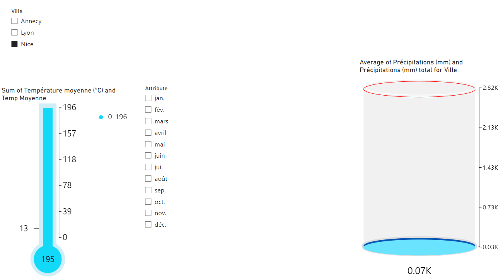

# Analyse Climatique : Températures et Précipitations par Ville et par Mois

## Description
Ce projet Power BI montre les tendances climatiques dans plusieurs villes françaises, notamment l'évolution des températures et des précipitations par mois. Il comprend des graphiques et des indicateurs clés pour illustrer ces tendances.

## Objectifs
- Visualiser les tendances climatiques historiques dans différentes villes françaises.
- Comparer les températures moyennes et les précipitations par mois entre les villes sélectionnées.
- Fournir des insights sur les variations climatiques mensuelles.

## Données Utilisées
Les données proviennent de relevés météorologiques historiques et comprennent les villes suivantes :
- Annecy
- Lyon
- Nice

Chaque table contient les colonnes suivantes :
- **Attribute** (Nom du mois)
- **Température minimale moyenne (°C)**
- **Température moyenne (°C)**
- **Température maximale moyenne (°C)**
- **Record de froid (°C)**
- **Record de chaleur (°C)**
- **Précipitations (mm)**

## Étapes de Préparation et d'Analyse

1. **Connexion aux Sources de Données**
   - Importation des données climatiques historiques pour Annecy, Lyon et Nice.

2. **Préparation des Tables Individuelles**
   - Ajout d'une colonne personnalisée `ville` pour chaque table afin d'identifier la ville correspondante.

3. **Création de la Table de Référence `Map_mois`**
   - Création d'une table contenant la correspondance entre les noms des mois (`Attribute`) et leur numéro (`Num Mois`).

4. **Combinaison des Tables**
   - Fusion des tables des différentes villes en une table combinée `BDD`.

5. **Création des Visualisations**
   - **Thermomètre des Températures Moyennes :**
     - Affiche la somme des températures moyennes par ville.
   - **Cylindre des Précipitations Totales :**
     - Affiche la moyenne des précipitations totales par ville.
   - **Segments de Données (Slicers) :**
     - `ville` (Ville)
     - `Attribute` (Nom du mois)

## Résultat Final

### Auteur
Abdul Fattah EL ZUBAIDI

