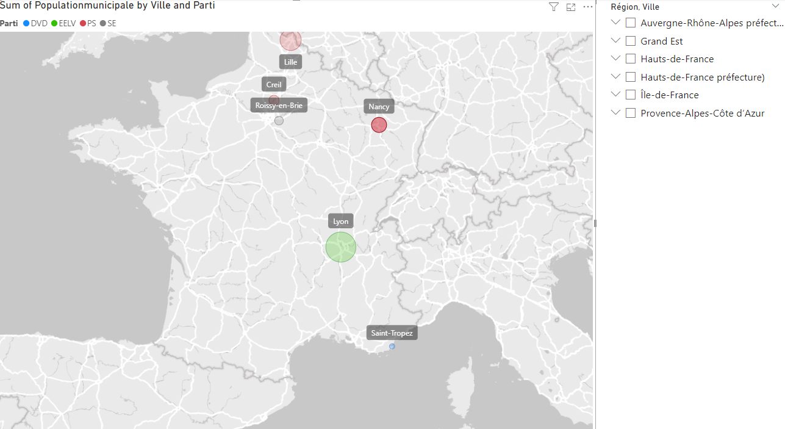

# Analyse Municipale : Populations, Partis Politiques et Mandats des Maires

## Description
Ce projet Power BI analyse les populations municipales, les partis politiques et les mandats des maires dans plusieurs villes françaises. Il présente des graphiques et des cartes pour illustrer ces informations.

## Objectifs
- Visualiser la répartition des populations municipales par ville.
- Comparer les partis politiques au pouvoir dans différentes villes.
- Présenter les informations clés sur les maires et leurs mandats.

## Données Utilisées
Les données proviennent de fiches municipales et comprennent les villes suivantes :
- Creil
- Lille
- Lyon
- Nancy
- Roissy-en-Brie
- Saint-Tropez

Chaque fiche contient les colonnes suivantes :
- **Ville**
- **Région**
- **Département**
- **Arrondissement**
- **Intercommunalité**
- **Populationmunicipale**
- **Parti**
- **Maire Mandat**

## Étapes de Préparation et d'Analyse

1. **Connexion aux Sources de Données**
   - Importation des fiches municipales pour chaque ville.

2. **Préparation des Tables Individuelles**
   - Ajout d'une colonne personnalisée `ville` pour chaque fiche afin d'identifier la ville correspondante.

3. **Combinaison des Tables**
   - Fusion des différentes fiches en une table combinée `BDD Fiche Ville`.

4. **Création des Visualisations**
   - **Carte des Populations Municipales :**
     - Type : Carte de chaleur
     - Axe X : `Coordonnées`
     - Valeur : `Populationmunicipale`
   - **Graphique des Partis Politiques :**
     - Type : Diagramme circulaire
     - Valeur : `Parti`
   - **Segments de Données (Slicers) :**
     - `Région`
     - `Ville`

## Résultat Final

### Auteur
Abdul Fattah EL ZUBAIDI
