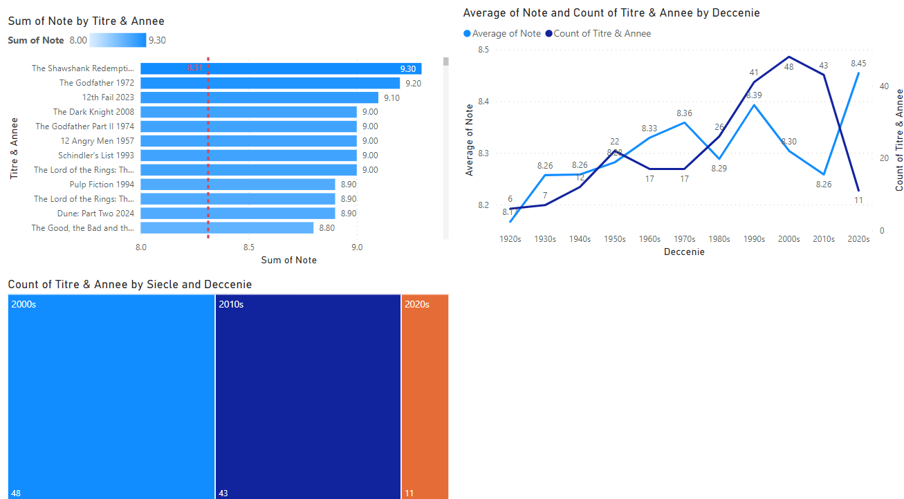

# Classement IMDb : Analyse des Films du Top 250

## Description
Ce projet Power BI analyse les films du Top 250 IMDb, en fournissant des graphiques pour visualiser les notes, les décennies et d'autres informations pertinentes.

## Objectifs
- Visualiser les notes des films du Top 250 IMDb.
- Comparer le nombre de films par décennie.
- Identifier les tendances dans les notes des films au fil du temps.

## Données Utilisées
Les données proviennent de la liste des films du Top 250 IMDb et comprennent les colonnes suivantes :
- **Titre**
- **Note**
- **Année**
- **Durée**
- **Limite Age**
- **NB Avis** (Nombre d'avis)
- **Décennie**

## Étapes de Préparation et d'Analyse

1. **Connexion aux Sources de Données**
   - Importation de la liste des films du Top 250 IMDb.

2. **Préparation des Tables Individuelles**
   - Extraction des affiches des films (`Dim Affiche`).
   - Ajout des affiches aux films correspondants.

3. **Création de la Table Principale `TOP 250 IMDb`**
   - Ajout de colonnes personnalisées pour la décennie, la limite d'âge, etc.

4. **Création des Visualisations**
   - **Graphique en Barres des Notes des Films :**
     - Axe Y : `Titre & Année`
     - Axe X : `Sum(Note)`
   - **Graphique Linéaire des Notes Moyennes par Décennie :**
     - Axe X : `Décennie`
     - Axe Y : `Average(Note)`
     - Série : `Count(Titre & Année)`
   - **Diagramme en Treemap par Siècle et Décennie :**
     - Axe X : `Siècle`
     - Axe Y : `Décennie`

## Résultat Final

### Auteur
Abdul Fattah EL ZUBAIDI
